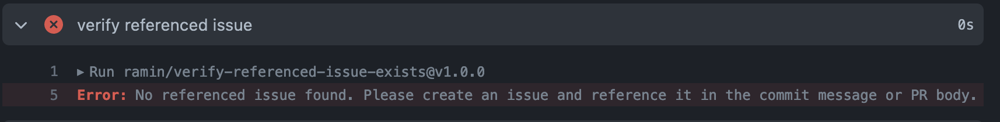

# Verify Linked Issue Action
A GitHub action that verifies your pull request contains a reference to an issue.

On a PR that does not include a linked issue or reference to an issue in the body, the check should fail and a comment will be added to the PR.



## Installation

### As a part of an existing workflow
``` yaml
- name: Verify Linked Issue
  uses: ramin/verify-referenced-issue-exists@v1.2.0
  env:
    GITHUB_TOKEN: ${{ secrets.GITHUB_TOKEN }}
```

Pleasure ensure the following types on the pull_request triggers:
```yaml
  pull_request:
    types: [edited, synchronize, opened, reopened]
```

### As a separate workflow
* Ensure you have the folder .github/workflows
* In .github/workflows, place the [pr_verify_linked_issue.yml](example/pr_verify_referenced_issue.yml) workflow.

### Inputs
(Optional) The action will add the following text to a PR when verification fails.
'Build Error! No Linked Issue found. Please link an issue or mention it in the body using #<issue_id>'

You can customize this message by providing an optional 'message' input with the string you would like to include as the comment.

```yaml
- name: Verify Linked Issue
  uses: ramin/verify-referenced-issue-exists@v1.2.0
  env:
    GITHUB_TOKEN: ${{ secrets.GITHUB_TOKEN }}
  with:
    comment:
      enabled: true
      message: 'Error! This is a custom error'
 ```

### File Templates
If you want a more complex message, consider using a static template file. (Support for dynamic templates will be coming soon!)

There are two options when using template files:

* Option 1) Default File Path: Add a file to .github called VERIFY_PR_COMMENT_TEMPLATE.md. The content of this file will be used as the fail comment in the PR.
* Option 2) Speciy a filename input with the path to a template file.
```yaml
- name: Verify Linked Issue
  uses: ramin/verify-referenced-issue-exists@v1.2.0
  env:
    GITHUB_TOKEN: ${{ secrets.GITHUB_TOKEN }}
  with:
    filename: 'example/templates/fail_comment.txt'
    ignore_label: hotfix
```

## Trying it out

* Create a new pull request and take care to not include a linked item or mention an issue.
* The build should fail.
* Edit the PR body and add a reference to a valid issue with a url (e.g. github.com/ramin/verify-referenced-issue-exists/issues/123 ) and let github turn it into an embeded markdown link


